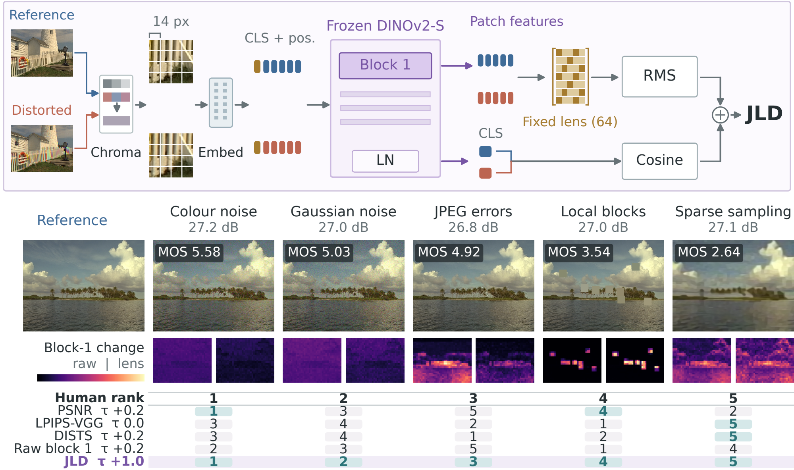

# JLD: Perceptual Distance through a Jacobian Lens

[Project page](https://shreshthsaini.github.io/jld/) | [Paper](https://shreshthsaini.github.io/jld/downloads/paper.pdf) (preprint, 2026) | [Code](https://github.com/shreshthsaini/jld) | [Blog](https://shreshthsaini.github.io/jld/blog/)

Shreshth Saini, Balu Adsumilli, Alan C. Bovik

JLD is a full-reference perceptual distance between two images, computed from a
frozen DINOv2-S/14 encoder. It compares the block-1 patch tokens of the two
images after projecting them onto 64 directions, the top eigenvectors of the
encoder's output-sensitivity matrix E[JᵀJ], which we call the Jacobian lens. The
lens is fitted once, in about 35 seconds on one GPU, from 100 unlabelled images
and without any human rating. JLD adds a cosine term on the encoder's final CLS
token and a chroma pre-filter; JLD-fast drops the CLS term and stops after the
first block. This repository contains the metric, the fitted lens, and the code
to fit a new lens, reproduce the paper's correlation numbers, and measure cost.

<p align="center"></p>

## Install

```bash
git clone https://github.com/shreshthsaini/jld.git
cd jld
pip install -e .          # or: uv sync
```

Python 3.10 or newer. The fitted lens ships inside the package. The DINOv2-S/14
weights are downloaded through `timm` from Hugging Face on first use. JLD runs
on a GPU when one is available and on the CPU otherwise.

## Quick start

```python
from jld import JLD
jld = JLD.pretrained("full")            # "fast" for JLD-fast
d = jld("examples/parrots.png", "examples/parrots_jpeg_q8.png")   # tensor([0.2462])
```

The result is a distance: lower means more similar, and identical images give
zero. Inputs can be file paths, PIL images, H x W x 3 arrays, or float tensors in
[0, 1] of shape [3, H, W] or [B, 3, H, W]; one image can be compared against a
batch. Images are used at native resolution and centre-cropped to multiples of
14 pixels. Both images of a pair must have the same size.

```python
local = jld.map(ref, dist)                 # [B, H/14, W/14] per-patch lens response
loss = jld.distance_tensor(ref, dist)      # differentiable scalar, for use as a loss
per_pair = jld.distance_per_sample_tensor(ref, dist)   # differentiable, one value per pair
```

`jld(ref, dist)` builds no autograd graph. The local map shows where the lens
term responds; it does not include the CLS term.

| Variant | Call | What it computes |
| --- | --- | --- |
| JLD | `JLD.pretrained("full")` | lens term + 0.5 x CLS cosine term, chroma pre-filter (sigma 2 px) |
| JLD-fast | `JLD.pretrained("fast")` | lens term with the chroma pre-filter; stops after block 1 |
| ablation | `JLD.pretrained("lens")` | lens term alone, no pre-filter |
| ablation | `JLD.pretrained("raw")` | unprojected 384-d block-1 tokens |

The lens term is a pseudometric (it satisfies the triangle inequality). The full
score adds a cosine term and need not satisfy it.

## Command line

```bash
jld examples/parrots.png examples/parrots_jpeg_q8.png                 # JLD (full) = 0.2462
jld examples/parrots.png examples/parrots_jpeg_q8.png --variant fast  # JLD (fast) = 0.2139
jld examples/bikes.png examples/bikes_blur.png --map blur_map.png     # also write the local map
python scripts/demo.py                                                # rank the bundled example pairs
```

`python -m jld` is equivalent to `jld`. `--lens my_lens.npz` scores with a lens
you fitted yourself, and `--device cpu` forces the CPU. `examples/` holds three
Kodak references and eight distorted versions; their scores for every variant
are recorded in [examples/expected.json](examples/expected.json).

## Fitting a lens

The lens is the only fitted part of JLD. Fitting needs a folder of unlabelled
images and no ratings, image pairs or distortions: it averages JᵀJ, the
sensitivity of the encoder's CLS output to the tokens of one block, over random
crops, and keeps the top eigenvectors.

```bash
# the paper's lens: 100 DIV2K validation images (downloaded into data/div2k)
python scripts/fit_lens.py --div2k data/div2k --out lens/refit.npz --compare shipped

# your own images
python scripts/fit_lens.py --images path/to/images --out lens/mine.npz

# another timm ViT or another block
python scripts/fit_lens.py --images path/to/images --encoder vit_base_patch14_dinov2.lvd142m \
    --layer 1 --out lens/dinov2_b14_block1_k64.npz
```

Defaults are the paper's settings: 100 images, four random 224 x 224 crops per
image, eight Gaussian probes per crop, seed 0, and k = 64 directions.
`--compare` reports the subspace overlap with another lens. On a GPU the first
command reproduces the shipped lens (overlap 1.0000). A CPU fit draws different
random probes and gave overlap 0.977, in line with the 0.962 the paper reports
for independent refits; it took 37 seconds on 24 threads. Use a fitted lens
with `JLD.from_lens("lens/mine.npz")` or `jld REF DIST --lens lens/mine.npz`;
the encoder and block are read from the file. The chroma sigma and the CLS
weight were chosen for DINOv2-S/14 and are arguments of `JLD.from_lens`. The
same function is available in Python as `jld.fit_lens`.

## Evaluation

`scripts/evaluate.py` computes SRCC, PLCC and KRCC against human ratings on
TID2013, CSIQ, LIVE, KADID-10k and PIPAL, and prints the paper's numbers next to
the measured ones.

```bash
pip install -e ".[eval]"                       # pandas and scipy
python scripts/evaluate.py --data-root data    # JLD and JLD-fast on the five datasets of the main table
python scripts/evaluate.py --data-root data --datasets csiq live --limit 100   # quick check on a subset
python scripts/evaluate.py --data-root data --metrics jld psnr ssim lpips_vgg dists   # with pyiqa baselines
```

Datasets are looked up below `--data-root` and, if missing, downloaded from the
Hugging Face mirrors used by [pyiqa](https://github.com/chaofengc/IQA-PyTorch)
(`--offline` forbids this). Each dataset has its own licence terms. The layout
is what the pyiqa archives unpack to; folders are matched by suffix, so extra
nesting is fine:

```
data/
  meta/meta_info_{TID2013,CSIQ,LIVEIQA,KADID10k,PIPAL}Dataset.csv   pair lists and scores (pyiqa metainfo)
  tid2013/.../reference_images/I01.BMP      tid2013/.../distorted_images/i01_01_1.bmp
  csiq/.../src_imgs/1600.png                csiq/.../dst_imgs/1600.AWGN.1.png
  live/.../refimgs/bikes.bmp                live/.../{jp2k,jpeg,wn,gblur,fastfading}/img1.bmp
  kadid10k/.../I01.png                      kadid10k/.../I01_01_01.png
  pipal/.../Val_Ref/A0005.bmp               pipal/.../Val_Dist/A0005_10_00.bmp
```

Protocol: native resolution, both images centre-cropped to multiples of 14, no
resizing. `kadid10k_test` is the 65 KADID-10k references (8,125 pairs) listed in
[splits/kadid10k_split.json](splits/kadid10k_split.json); the other 16
references were used for development. `pipal_val` is the 1,000 pairs of the
official PIPAL validation split. Correlations are absolute values. Per-pair
scores are saved in `results/<dataset>_scores.csv` and reused on later runs. The
baselines need `pip install -e ".[baselines]"`.

A GPU is recommended for the full run. On a 16-thread CPU, CSIQ and LIVE (1,645
pairs) took about seven minutes for JLD and JLD-fast together.

## Benchmarking

`scripts/benchmark.py` measures cost per image pair at batch size one: FLOPs,
median latency and peak GPU memory.

```bash
python scripts/benchmark.py                                   # JLD and JLD-fast, 512 x 384 inputs
python scripts/benchmark.py --height 768 --width 1024
python scripts/benchmark.py --baselines psnr ssim lpips-vgg dists     # pyiqa metrics, same protocol
python scripts/benchmark.py --device cpu --threads 12 --repeats 5 --warmup 2
```

The paper's cost columns use 512 x 384 inputs on an NVIDIA A100. FLOP counts
come from `torch.utils.flop_counter` and are the same on any device: the script
gives 118.5 GFLOPs per pair for JLD and 10.8 for JLD-fast. The paper's 10.7 for
JLD-fast is the count without the chroma pre-filter (`--variants lens`).
Latency depends on the hardware.

## Results

Spearman correlation with human ratings (higher is better) and cost per pair,
from the main table of the paper. Costs are for 512 x 384 inputs at batch size
one on an A100. "Human labels" says whether the distance was fitted to human
judgements.

| Method | Human labels | GFLOPs | ms | TID2013 | CSIQ | LIVE | KADID-10k test | Mean | PIPAL val |
| --- | --- | ---: | ---: | ---: | ---: | ---: | ---: | ---: | ---: |
| PSNR | no | <0.1 | 1.4 | 0.687 | 0.809 | 0.873 | 0.673 | 0.760 | 0.255 |
| SSIM | no | 0.2 | 2.7 | 0.627 | 0.837 | 0.910 | 0.621 | 0.749 | 0.363 |
| VSI | no | <0.1 | 9.9 | 0.895 | 0.940 | 0.949 | 0.876 | 0.915 | 0.450 |
| DeepWSD | no | 60.2 | 13.5 | 0.855 | 0.959 | 0.955 | 0.882 | 0.913 | 0.460 |
| DeepDC | no | 326.4 | 16.1 | 0.816 | 0.954 | 0.950 | 0.900 | 0.905 | 0.751 |
| LPIPS-VGG | yes | 240.6 | 10.9 | 0.670 | 0.883 | 0.932 | 0.724 | 0.802 | 0.612 |
| DISTS | yes | 240.7 | 9.9 | 0.818 | 0.943 | 0.954 | 0.885 | 0.900 | 0.704 |
| PieAPP | yes | 385.7 | 16.5 | 0.844 | 0.897 | 0.918 | 0.864 | 0.881 | 0.706 |
| DreamSim | yes | 212.2 | 51.3 | 0.812 | 0.911 | 0.910 | 0.851 | 0.871 | 0.759 |
| **JLD-fast** | no | 10.7 | 2.5 | 0.875 | 0.956 | 0.945 | 0.870 | 0.911 | 0.578 |
| **JLD** | no | 118.5 | 12.2 | 0.877 | 0.971 | 0.964 | 0.892 | 0.926 | 0.624 |

Mean is over the first four datasets. LIVE, the KADID-10k test references and
PIPAL validation are held out. CSIQ and the 16 KADID-10k development references
were used to select the configuration, and TID2013 informed the chroma
pre-filter. The lens itself is fitted
without human data. The paper's table has more baselines, and JLD is not the
best method on PIPAL validation.

`python scripts/evaluate.py` reproduces the JLD and JLD-fast correlations in
this table to three decimals on all five datasets with the shipped lens.

## Tests

```bash
pip install -e ".[eval,test]"
pytest
```

The suite takes about a minute on a multi-core CPU. It uses only the bundled examples and
the encoder weights, not the benchmark datasets. It checks that identical
images give zero, symmetry, the triangle inequality of the lens term, monotonic
response to increasing blur, noise and JPEG compression, agreement with
`examples/expected.json`, the JLD-fast path, the shipped lens (384 x 64,
orthonormal), lens fitting, and the command line tools.

## Repository layout

```
jld/                 the package
  metric.py          JLD class: variants, scoring, local map, differentiable distance
  lens.py            Lens file format and fit_lens
  encoder.py         frozen timm ViT wrapper returning one block and the final CLS token
  frontend.py        chroma pre-filter
  images.py          image loading and the crop rule
  cli.py             the `jld` command
  data/              the fitted lens, jld_dinov2_s14_block1_k64.npz
scripts/
  demo.py            score and rank the example pairs
  fit_lens.py        fit a lens from unlabelled images
  evaluate.py        correlation with human ratings on the five datasets
  benchmark.py       FLOPs, latency and memory per pair
examples/            three Kodak references, eight distorted versions, expected scores
splits/              KADID-10k development and test references
tests/               pytest suite
docs/                project page (https://shreshthsaini.github.io/jld/)
```

The package implements image JLD. The video experiments of the paper are not
part of this code.

## Citation

```bibtex
@article{saini2026jld,
  title={JLD: Perceptual Distance through a Jacobian Lens},
  author={Saini, Shreshth and Adsumilli, Balu and Bovik, Alan C.},
  journal={arXiv preprint},
  year={2026}
}
```

## Licence

The code and the fitted lens are released under the [MIT licence](LICENSE).
The DINOv2 weights, the benchmark datasets and the example images keep their
own terms. The example images are derived from the Kodak Lossless True Color
Image Suite hosted by Rich Franzen (see `examples/make_examples.py`).

## Acknowledgements

JLD uses the [DINOv2](https://github.com/facebookresearch/dinov2) ViT-S/14
encoder through [timm](https://github.com/huggingface/pytorch-image-models).
The evaluation script uses the dataset mirrors, pair lists and baseline
implementations of [pyiqa](https://github.com/chaofengc/IQA-PyTorch). The
shipped lens was fitted on the [DIV2K](https://data.vision.ee.ethz.ch/cvl/DIV2K/)
validation images.
